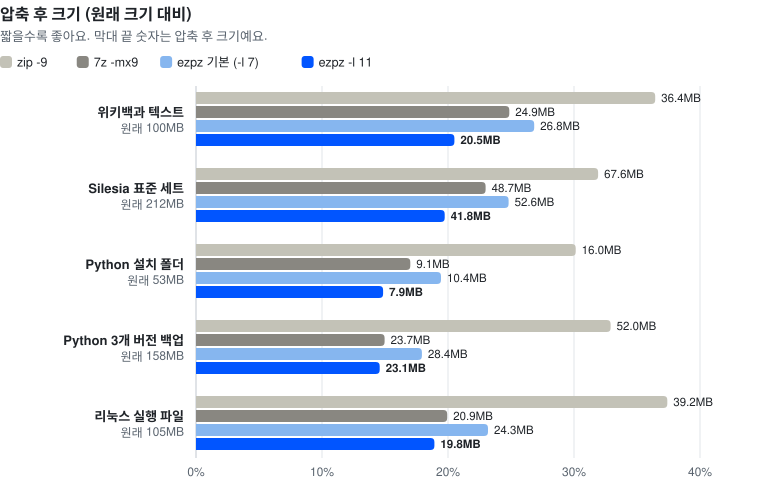
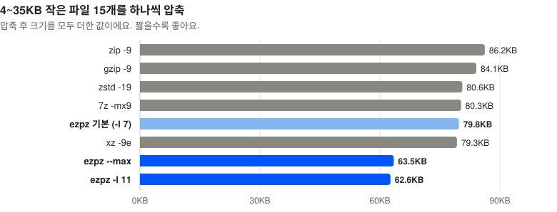

<p align="center"></p>

# ezpz: `.ezpz` 아카이브 포맷 레퍼런스 구현

[English](README.md) | 한국어

zip·7z 같은 "여러 파일을 묶고 줄이는" 포맷이에요. 검증된 압축기(zstd, LZMA2)를 똑똑하게 조합하고 직접 만든 **뇌 코덱**(예측 부호화 + 실시간으로 배우는 신경망)을 최대 압축 모드로 넣었어요. `--max`는 빠른 버전을, `-l 11`은 원래 버전을 써요. 둘 다 흔한 글과 코드, 데이터를 미리 배운 상태(타고난 지식)에서 시작해서 작은 파일에서 특히 유리하고 zstd를 쓰는 레벨도 같은 지식을 사전으로 써요. 프로그램 파일은 기계어 속 호출 주소와 데이터 주소를 코드에서 빼내 따로 모을 수 있어요(7z의 BCJ2와 비슷한 방식). 그러면 빌드가 달라도 비슷한 코드가 길게 한 번에 맞아떨어져요.

- 규격서: [SPEC.ko.md](SPEC.ko.md)
- 벤치마크: [BENCHMARK.ko.md](BENCHMARK.ko.md)
- 브라우저에서: [web/](web/README.ko.md)의 페이지로 설치 없이 `.ezpz`를 풀고 만들 수 있어요(웹어셈블리, 업로드 없음)

## 결과 한눈에

<picture>
  <source media="(prefers-color-scheme: dark)" srcset="assets/chart-sizes-ko-dark.svg">
  
</picture>

뇌 코덱을 쓰는 두 설정으로 압축한 크기를 xz·7z의 최고 압축과 나란히 놓았어요. `--max`는 빠른 뇌 코덱을 쓰고 `-l 11`은 원래 뇌 코덱을 써서 1.6~4배 느려요. 괄호 안은 xz와 7z 중 더 작게 만든 쪽과 비교한 값이에요.

| 데이터 | 원래 크기 | xz -9e | 7z -mx9 | ezpz --max | ezpz -l 11 |
|---|---|---|---|---|---|
| 위키백과 텍스트 (enwik8) | 100.0MB | 24.8MB | 24.9MB | 21.5MB (xz -9e보다 13.3% 작음) | **20.5MB** (xz -9e보다 17.4% 작음) |
| Silesia 표준 테스트 세트 | 211.9MB | 48.4MB | 48.7MB | 43.2MB (xz -9e보다 10.9% 작음) | **41.8MB** (xz -9e보다 13.6% 작음) |
| Python 설치 폴더 | 53.2MB | 9.1MB | 9.1MB | 9.0MB (7z -mx9보다 0.8% 작음) | **7.9MB** (7z -mx9보다 12.7% 작음) |
| Python 3개 버전 백업 | 158.2MB | 24.3MB | 23.7MB | 26.4MB (7z -mx9보다 11.5% 큼) | **23.1MB** (7z -mx9보다 2.6% 작음) |
| 리눅스 실행 파일 | 104.9MB | 23.1MB | 20.9MB | 22.3MB (7z -mx9보다 6.8% 큼) | **19.8MB** (7z -mx9보다 5.1% 작음) |

<picture>
  <source media="(prefers-color-scheme: dark)" srcset="assets/chart-small-ko-dark.svg">
  
</picture>

텍스트에서는 `--max`도 큰 차이로 앞서요. 프로그램 파일과 백업에서는 7z와 비슷하거나 더 커지고 거기서도 앞서는 건 `-l 11`이에요. 이제 실행 파일에서도 `-l 11`이 가장 작아요. 차이가 가장 큰 건 작은 파일이에요. 4~35KB 파일 15개에서 `--max`가 xz -9e보다 19.9%, zip -9보다 26.4% 작고 기본 레벨도 zip -9보다 7.5% 작아요. 기본 레벨은 tar.zst -19와 비슷한 크기에, 파일 하나를 0.1초 안에 꺼낼 수 있어요. 자세한 수치는 [BENCHMARK.ko.md](BENCHMARK.ko.md)에 있어요.

## 빌드

Rust 1.85 이상이 필요해요(edition 2024 사용). (맥: `brew install rust` 또는 https://rustup.rs)

```bash
cargo build --release
# 실행 파일: target/release/ezpz
```

외부 라이브러리(zstd, liblzma)는 소스째 같이 빌드되므로 따로 설치할 게 없어요.

## 사용법

```bash
# 압축 (기본 레벨 7: tar.zst -19 수준으로 작고, 푸는 건 아주 빠름)
ezpz c 프로젝트.ezpz 내폴더/ 다른파일.txt

# 레벨 1(제일 빠름)~9는 푸는 게 빨라요. --max(레벨 10)는 빠른 뇌 코덱: 텍스트에서 더 작지만 풀 때 느림
ezpz c 보관용.ezpz 내폴더/ -l 9
ezpz c 보관용.ezpz 내폴더/ --max

# 레벨 11은 원래 뇌 코덱: 가장 작고 가장 느림
ezpz c 보관용.ezpz 내폴더/ -l 11

# 풀기 / 일부만 풀기
ezpz x 프로젝트.ezpz -C 풀폴더/
ezpz x 프로젝트.ezpz 내폴더/docs -C 풀폴더/

# 목록, 파일 하나만 바로 보기(필요한 블록만 읽음)
ezpz l 프로젝트.ezpz
ezpz cat 프로젝트.ezpz 내폴더/README.md

# 무결성 검사
ezpz verify 프로젝트.ezpz

# 암호화 (파일 이름까지 숨김). 비밀번호는 물어보거나 --password / EZPZ_PASSWORD
ezpz c 비밀.ezpz 내폴더/ -e

# 비밀번호 없이도 손상 검사는 가능 (서명된 파일이면 변조까지)
ezpz verify 비밀.ezpz --no-password

# 전자 서명: 키 만들기 → 서명해서 압축 → 받는 사람이 공개키로 확인
ezpz keygen 나
ezpz c 배포.ezpz 내폴더/ --sign 나.key
ezpz verify 배포.ezpz --pubkey 나.pub

# 아카이브 정보(코덱별 블록, 중복 제거량, 지문 등)
ezpz info 프로젝트.ezpz
```

자주 쓰는 옵션: `-j N`(스레드 수), `--block-size MiB`, `--codec zstd|lzma2|brain|brain-fast|store`, `--no-dedup`, `--no-filter`, `--hash-len 0|16|32`, `-f/--force`(덮어쓰기), `--unsafe-links`(폴더 밖을 가리키는 심볼릭 링크도 만들기).

## 브라우저에서 쓰기

[`web/`](web/README.ko.md) 폴더에는 이 코드를 웹어셈블리로 빌드해서 브라우저에서 `.ezpz`를 풀고 만드는 페이지가 있어요. 파일은 기기 안에서만 다루고 아무것도 업로드하지 않아요.

- `web/dist/ezpz.html`을 바로 열면 돼요. 필요한 게 모두 들어 있는 파일 하나예요.
- 폴더를 서버로 띄워도 돼요(`python3 -m http.server -d web`). 그다음 `index.html`을 여세요.
- 다른 사이트에 넣으려면 `web/pkg/`(웹어셈블리 모듈과 자바스크립트 연결 코드)와 `web/worker.js`를 가져가세요. API는 [web/README.ko.md](web/README.ko.md)에 있어요.

브라우저판은 명령어 도구가 만든 아카이브를 모두 풀어요. 다만 LZMA2 압축기가 없어서 레벨 9는 zstd로만 압축해요. 코어도 하나만 써요. 레벨 9를 뺀 나머지 레벨에서는 만드는 블록이 명령어 도구와 바이트 단위로 같아요.

## 구조 (소스 파일)

| 파일 | 하는 일 |
|---|---|
| `src/lib.rs` | 명령어 도구와 웹어셈블리판이 같이 쓰는 라이브러리 |
| `src/main.rs` | 명령어 도구 |
| `src/format.rs` | 헤더·프레임·트레일러·서명 섹션의 바이트 배치, varint, 경로 규칙 |
| `src/index.rs` | 블록 테이블과 카탈로그(열 단위 인덱스) 인코딩/디코딩 |
| `src/codec.rs` | store / zstd / LZMA2 / brain 코덱 연결 |
| `src/brain.rs` | 뇌 코덱: 컨텍스트 모델(빠른 버전은 6개, 원래 버전은 9개) + 매치 모델 + 신경망 믹서 + APM + 산술 부호기 |
| `src/filter.rs` | 실행 파일 전처리(x86 E8/E9, RIP 상대 주소까지 제자리에서 바꾸거나 파일 끝으로 모으는 x86-64, ARM64 BL) |
| `src/classify.rs` | 파일 분류(실행 파일 / 이미 압축됨 / 일반) |
| `src/create.rs` | 압축기: 분류 → 정렬 → 내용 기반 조각내기 → 중복 제거 → 블록 병렬 압축 (파일에서 또는 메모리에서) |
| `src/archive.rs` | 해제기: 검증, 블록 캐시, 랜덤 접근, 안전한 추출 (파일에서 또는 메모리에서) |
| `src/crypto.rs` | Argon2id + XChaCha20-Poly1305 |
| `prime/v1.txt` | 뇌 코덱과 zstd 사전에 쓰는 내장 사전 학습 데이터(포맷의 일부) |
| `wasm/` | 웹어셈블리 연결 코드(열기, 목록, 꺼내기, 검사, 만들기) |
| `web/` | 브라우저 페이지, Web Worker, 빌드된 패키지(`web/pkg`), 파일 하나짜리 페이지(`web/dist`) |
| `assets/` | 로고와 README 차트(`bench/charts.py`가 벤치마크 결과로 그림) |

## 독립 구현 검증

`tools/ezpz_reader.py`는 **SPEC.md만 보고** 따로 만든 파이썬 해제기예요(Rust 코드를 보지 않고 작성). `testvectors/`의 아카이브를 이 해제기로 풀어서 원본과 비교하면 규격서만으로 호환 구현이 가능하다는 걸 확인할 수 있어요. 빠른 뇌 코덱, x86-64 전처리 두 가지, 사전 학습, 사전 학습 데이터를 쓰는 zstd도 나중에 같은 방식으로, 규격서만 보고 추가했어요.

```bash
pip install zstandard blake3 cryptography
python3 tools/ezpz_reader.py testvectors/brain.ezpz --out /tmp/out --compare testvectors/input --sub input
python3 tools/ezpz_reader.py testvectors/brain-fast.ezpz --out /tmp/out2 --compare testvectors/input --sub input
python3 tools/ezpz_reader.py testvectors/x86-64-split.ezpz --out /tmp/out3 --compare testvectors/input-x64 --sub input-x64
python3 tools/ezpz_reader.py testvectors/signed.ezpz --pub testvectors/k.pub
```

암호화된 아카이브를 풀려면 `pip install argon2-cffi pynacl`도 설치하고 `--password`를 주면 돼요.

## 테스트

```bash
cargo test --release      # 단위 테스트 (포맷, 변조된 인덱스 거부, 경로 공격 등)
tests/e2e.sh              # 실제 CLI로 왕복·변조·암호·서명 시나리오
node web/test.mjs         # 웹어셈블리판: 테스트 파일을 모두 풀고 아카이브를 만들어 다시 열기
```

## 솔직한 한계

- 뇌 코덱은 압축과 해제가 둘 다 느려요. `--max`가 2코어 서버에서 초당 약 2MB, 코어 4개인 맥에서 약 5MB이고 `-l 11`은 그보다 1.6~4배 느려요. 파일 하나를 꺼낼 때도 그 파일이 든 블록(`--max`는 16MB, `-l 11`은 64MB)을 통째로 풀어야 해요. 그래서 기본 레벨은 zstd를 써요.
- `--max`는 속도를 얻는 대신 크기를 내줬어요. 프로그램 파일과 백업에서는 `-l 11`보다 13~15% 커요. 설치 폴더에서는 7z와 비슷하고 백업과 실행 파일에서는 7z보다 커요. 이런 데이터를 가장 작게 만들려면 `-l 11`을 쓰세요.
- 실행 파일에서 zstd·LZMA2 레벨은 아직 7z에 못 미쳐요(`-l 9`가 1.7% 큼). 7z보다 작게 만드는 건 `-l 11`뿐이에요.
- 이미 압축된 데이터(jpg, mp4, zip 등)는 어떤 방법으로도 거의 줄지 않아요. ezpz는 이런 파일을 알아보고 그대로 저장해서 시간만 아껴요.
- 서명 없는 아카이브의 해시 검사는 **실수로 생긴 손상**(전송 오류, 디스크 손상)을 잡아요. 누군가 **일부러 고친 것**까지 확인하려면 `--sign`으로 서명하고 받는 쪽에서 `verify --pubkey`로 확인하세요(공개키를 지정하면 서명 없는 파일은 거부돼요).
- 아직 v1 초안이에요. 규격이 바뀔 수 있으니 중요한 데이터의 유일한 보관본으로는 쓰지 마세요.

## 라이선스

[MIT 라이선스](LICENSE)로 공개해요. 쓰기·고치기·다시 배포·상업적 이용 모두 자유이고 규격서([SPEC.ko.md](SPEC.ko.md))를 보고 다른 언어로 호환 구현을 만들어도 돼요. MIT 라이선스는 코드 복사본마다 저작권 문구를 남기게 하는데, 그 문구에 EZPZ File과 사이트 주소가 들어 있어요.

ezpz나 웹어셈블리판을 제품·사이트·서비스에 쓴다면 사용자가 볼 수 있는 곳(정보 화면, 크레딧, 푸터 등)에 출처도 표시해 주세요.

    Powered by EZPZ File (https://ezpzfile.com)

