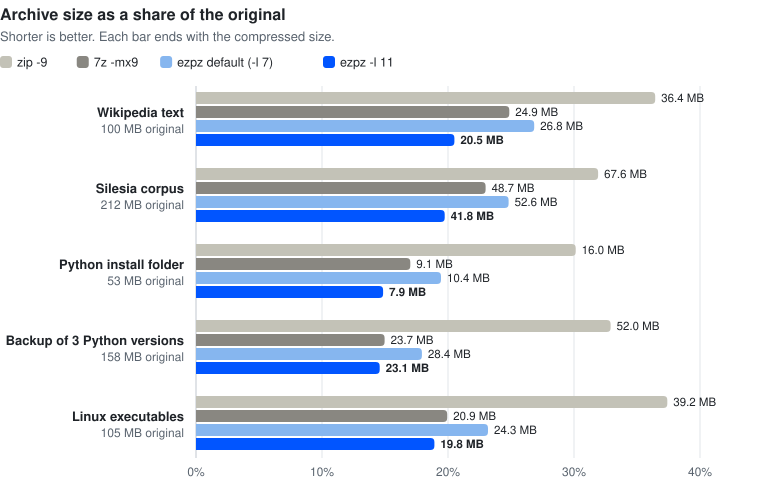
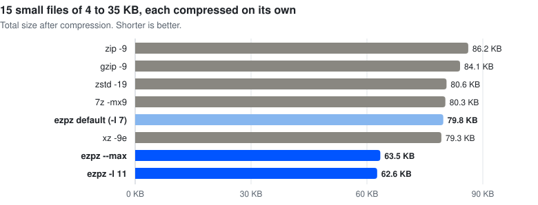

<p align="center"></p>

# ezpz: reference implementation of the `.ezpz` archive format

English | [한국어](README.ko.md)

`.ezpz` is an archive format in the same family as zip and 7z: it packs many files into one and compresses them. It combines proven compressors (zstd and LZMA2) with content-defined deduplication, solid blocks, encryption, and signatures. For maximum compression it adds a codec of its own, the brain codec, which predicts every bit before coding it and keeps learning as it goes. `--max` uses its fast version and `-l 11` its full version. Both start from built-in knowledge of common text, code, and data, which helps small files most, and the zstd levels use the same knowledge as a dictionary. For programs, ezpz can move call and data addresses out of the machine code (like 7z's BCJ2), so similar code compresses as one long match even across different builds.

- Specification: [SPEC.md](SPEC.md)
- Benchmark: [BENCHMARK.md](BENCHMARK.md)
- In a browser: [web/](web/README.md) opens, extracts, and creates `.ezpz` archives with the WebAssembly build, without uploading anything

## Results at a glance

<picture>
  <source media="(prefers-color-scheme: dark)" srcset="assets/chart-sizes-dark.svg">
  
</picture>

Archive sizes from the two brain codec settings, next to the best settings of xz and 7z. `--max` uses the fast brain codec. `-l 11` uses the full one and is 1.6 to 4 times slower. In parentheses: each ezpz size compared with whichever of xz and 7z made the smaller file.

| Data | Original | xz -9e | 7z -mx9 | ezpz --max | ezpz -l 11 |
|---|---|---|---|---|---|
| Wikipedia text (enwik8) | 100.0 MB | 24.8 MB | 24.9 MB | 21.5 MB (13.3% smaller than xz -9e) | **20.5 MB** (17.4% smaller than xz -9e) |
| Silesia corpus | 211.9 MB | 48.4 MB | 48.7 MB | 43.2 MB (10.9% smaller than xz -9e) | **41.8 MB** (13.6% smaller than xz -9e) |
| Python install folder | 53.2 MB | 9.1 MB | 9.1 MB | 9.0 MB (0.8% smaller than 7z -mx9) | **7.9 MB** (12.7% smaller than 7z -mx9) |
| Backup of three Python versions | 158.2 MB | 24.3 MB | 23.7 MB | 26.4 MB (11.5% larger than 7z -mx9) | **23.1 MB** (2.6% smaller than 7z -mx9) |
| Linux executables | 104.9 MB | 23.1 MB | 20.9 MB | 22.3 MB (6.8% larger than 7z -mx9) | **19.8 MB** (5.1% smaller than 7z -mx9) |

<picture>
  <source media="(prefers-color-scheme: dark)" srcset="assets/chart-small-dark.svg">
  
</picture>

On text, `--max` keeps most of the lead. On program files and backups it ends up about as large as 7z or larger, and `-l 11` is the setting that stays ahead, now on executables too. Small files show the biggest gap: across 15 files of 4 to 35 KB, `--max` is 19.9% smaller than xz -9e and 26.4% smaller than zip -9, and even the default level is 7.5% smaller than zip -9. The default level produces archives about the size of tar.zst -19 and can pull a single file out in under 0.1 s. The full numbers are in [BENCHMARK.md](BENCHMARK.md).

## Build

You need Rust 1.85 or newer (the crate uses edition 2024). On macOS, `brew install rust` works, or use https://rustup.rs.

```bash
cargo build --release
# binary: target/release/ezpz
```

The zstd and liblzma libraries are built from source along with the crate, so there is nothing else to install.

## Usage

```bash
# Compress (default level 7: about as small as tar.zst -19, and very fast to extract)
ezpz c project.ezpz my-folder/ notes.txt

# Levels 1 (fastest) to 9 extract quickly. --max (level 10) uses the fast brain codec: smaller on text, but slow to extract
ezpz c archive.ezpz my-folder/ -l 9
ezpz c archive.ezpz my-folder/ --max

# Level 11 uses the full brain codec: the smallest archives, and the slowest
ezpz c archive.ezpz my-folder/ -l 11

# Extract everything, or only part of the archive
ezpz x project.ezpz -C out/
ezpz x project.ezpz my-folder/docs -C out/

# List the contents, or print one file (only the blocks that hold it are read)
ezpz l project.ezpz
ezpz cat project.ezpz my-folder/README.md

# Check integrity
ezpz verify project.ezpz

# Encrypt (file names are hidden too). The password is prompted for, or taken from --password / EZPZ_PASSWORD
ezpz c secret.ezpz my-folder/ -e

# Damage checks work without the password (tamper checks too, if the archive is signed)
ezpz verify secret.ezpz --no-password

# Signatures: create a key pair, sign while compressing, and let the recipient check with the public key
ezpz keygen me
ezpz c release.ezpz my-folder/ --sign me.key
ezpz verify release.ezpz --pubkey me.pub

# Archive details (blocks per codec, bytes saved by deduplication, fingerprint, ...)
ezpz info project.ezpz
```

Other useful options: `-j N` (number of threads), `--block-size MiB`, `--codec zstd|lzma2|brain|brain-fast|store`, `--no-dedup`, `--no-filter`, `--hash-len 0|16|32`, `-f/--force` (overwrite existing files), and `--unsafe-links` (also create symbolic links that point outside the target folder).

## In a browser

The [`web/`](web/README.md) folder holds a page that opens, extracts, and creates `.ezpz` archives in a browser, using a WebAssembly build of this code. Nothing is uploaded: the page reads and writes files on your device.

- Open `web/dist/ezpz.html` straight from the disk; it is one file with everything inside.
- Or serve the folder (`python3 -m http.server -d web`) and open `index.html`.
- To use it on your own site, take `web/pkg/` (the WebAssembly module and its JavaScript glue) and `web/worker.js`. The API is in [web/README.md](web/README.md).

The browser build reads every archive the command-line tool writes. It has no LZMA2 encoder, so level 9 there compresses with zstd alone, and it works on one core. At every level except 9, the blocks it writes are byte for byte the same as the command-line tool's.

## Source layout

| File | Purpose |
|---|---|
| `src/lib.rs` | the library that the command-line tool and the WebAssembly build share |
| `src/main.rs` | the command-line tool |
| `src/format.rs` | byte layout of the header, frames, trailer, and signature section; varints; path rules |
| `src/index.rs` | encoding and decoding of the block table and the catalog (a column-oriented index) |
| `src/codec.rs` | glue for the store, zstd, LZMA2, and brain codecs |
| `src/brain.rs` | brain codecs: context models (9, or 6 in brain-fast), a match model, neural mixers, APM stages, and an arithmetic coder |
| `src/filter.rs` | executable transforms (x86 E8/E9, x86-64 with RIP-relative addresses in place or moved to the end of the file, ARM64 BL) |
| `src/classify.rs` | file classification (executable / already compressed / other) |
| `src/create.rs` | archiver: classify, sort, split into content-defined chunks, deduplicate, compress blocks in parallel (from files or from memory) |
| `src/archive.rs` | extractor: verification, block cache, random access, safe extraction (from a file or from memory) |
| `src/crypto.rs` | Argon2id and XChaCha20-Poly1305 |
| `prime/v1.txt` | built-in priming data for the brain codecs and the zstd dictionary (part of the format) |
| `wasm/` | WebAssembly bindings (open, list, extract, verify, create) |
| `web/` | the browser page, its Web Worker, the built package (`web/pkg`), and the single-file page (`web/dist`) |
| `assets/` | the logo and the README charts (drawn by `bench/charts.py` from the benchmark results) |

## Independent implementation

`tools/ezpz_reader.py` is a Python decoder written only from SPEC.md, without looking at the Rust code. Support for brain-fast, the x86-64 transforms, priming, and zstd with the priming dictionary was added the same way, from the specification alone. Decoding the archives in `testvectors/` with it and comparing the output with the original files shows that the specification alone is enough to build a compatible implementation.

```bash
pip install zstandard blake3 cryptography
python3 tools/ezpz_reader.py testvectors/brain.ezpz --out /tmp/out --compare testvectors/input --sub input
python3 tools/ezpz_reader.py testvectors/brain-fast.ezpz --out /tmp/out2 --compare testvectors/input --sub input
python3 tools/ezpz_reader.py testvectors/x86-64-split.ezpz --out /tmp/out3 --compare testvectors/input-x64 --sub input-x64
python3 tools/ezpz_reader.py testvectors/signed.ezpz --pub testvectors/k.pub
```

To decode encrypted archives, also install `argon2-cffi` and `pynacl` and pass `--password`.

## Tests

```bash
cargo test --release      # unit tests (format, rejection of tampered indexes, path attacks, ...)
tests/e2e.sh              # end-to-end CLI scenarios: round trips, tampering, encryption, signatures
node web/test.mjs         # the WebAssembly build: reads every test vector, creates and reopens archives
```

## Limitations

- The brain codecs are slow in both directions. `--max` runs at about 2 MB/s on a 2-core server and about 5 MB/s on a 4-core Mac, and `-l 11` is 1.6 to 4 times slower. Extracting one file means decoding the whole block that holds it (16 MB with `--max`, 64 MB with `-l 11`). That is why the default level uses zstd.
- `--max` trades size for speed. On program files and backups it is 13 to 15% larger than `-l 11`: about the same as 7z on the Python folder, and larger than 7z on the backup and the executables. For the smallest archive of such data, use `-l 11`.
- On executables, 7z still beats the zstd and LZMA2 levels (`-l 9` is 1.7% larger). Only `-l 11` makes them smaller than 7z does.
- Already-compressed data (jpg, mp4, zip, ...) barely shrinks with any method. ezpz recognizes such files and stores them as they are, which saves time.
- Hash checks on an unsigned archive catch accidental damage such as transfer or disk errors. To detect deliberate changes too, sign the archive with `--sign` and have the recipient run `verify --pubkey`. When a public key is given, unsigned files are rejected.
- The format was fixed at v1 with ezpz 1.0.0. Every later version will open v1 files, and new features are added only in ways that keep them opening.

## License

Released under the [MIT License](LICENSE). You are free to use, change, share, and sell it, and to build compatible implementations from the specification ([SPEC.md](SPEC.md)). The MIT License requires the copyright notice, which names EZPZ File and its website, to stay with every copy of the code.

If you use ezpz or its WebAssembly build in a product, website, or service, please also credit EZPZ File somewhere your users can see it, such as an about page, the credits, or a footer:

    Powered by EZPZ File (https://ezpzfile.com)
